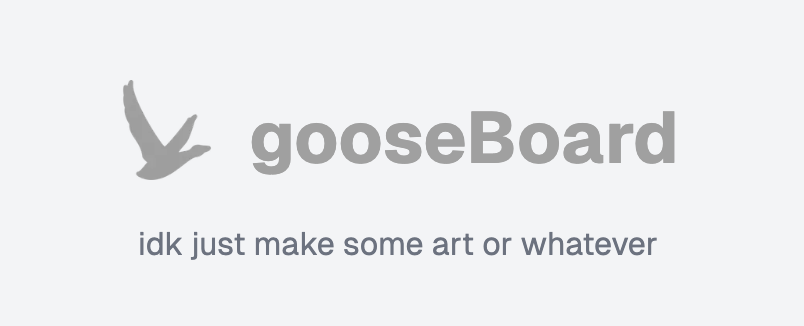

# gooseBoard

gooseBoard is a real-time collaborative canvas where everyone can draw together on a shared space, creating a dynamic and interactive experience. Built with React and Konva, it provides a smooth, user-friendly interface for seamless live drawing and collaboration.

## Features

- **Real-time Drawing**: Create drawings with mouse or touch input.
- **Customizable Lines**: Adjust stroke width and color for your drawings.
- **Automatic Saving**: Your drawings are automatically saved, allowing you to continue where you left off.
- **User Authentication**: Secure your artwork with user authentication using NextAuth.

## Installation

To run Gooseboard locally, follow these steps:

1. **Clone the Repository**:

   ```bash
   git clone https://github.com/puang59/gooseboard
   ```

2. **Navigate to the Project Directory**:

   ```bash
   cd gooseboard
   ```

3. **Install Dependencies**:
   If you are using Bun:

   ```bash
   bun install
   ```

   If you are using npm:

   ```bash
   npm install
   ```

4. **Start the Application**:
   If you are using Bun:

   ```bash
   bun start
   ```

   If you are using npm:

   ```bash
   npm start
   ```

5. **Open Your Browser**: Navigate to `http://localhost:3000` to view the application.

## Usage

- **Drawing**: Use your mouse or touch input to draw on the canvas.
- **Color Selection**: Choose from a palette of colors to customize your lines.
- **Clear Canvas**: Use the clear button to reset your drawing.
- **Save Your Work**: Your drawings will be saved automatically.

## Contributing

Contributions are welcome! If you have suggestions for improvements or new features, feel free to open an issue or submit a pull request.
